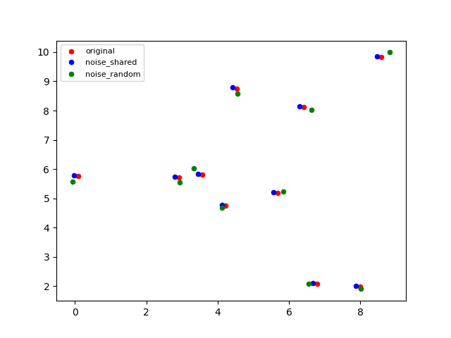

# point_cloud_matching   
   
This repository is a playpen area to explore point cloud alignment methods and similarity metrics

  

   

# Usage (from vscode)   

- Set up a virtual environment by running "python -m venv .env"
- Switch the the virtual environment
- run "pip install -e ." to install the **pointsym** packag and dependencies

The scripts folder includes some example deployments of the code in **pointsym**